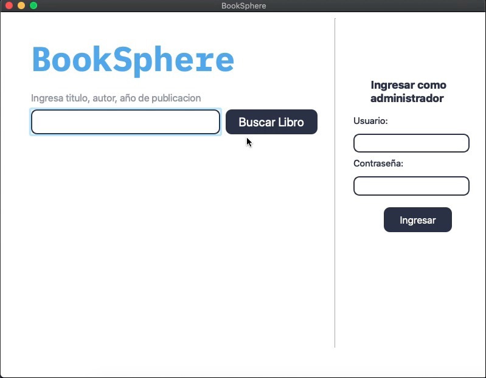

# BookSphere

This project is a desktop application developed in QT and C++ serving as a management system for libraries. It allows administrators to perform various tasks, such as searching for books in the library, managing users, administering the book inventory, and keeping track of loans.

## Key Features

1. **Book Search**: Users can search for books in the library using search criteria such as title, author, genre, etc.
   
2. **Administrator Login**: Administrators can access the system through a secure login to perform administrative tasks.

3. **Book Management**:
   - Add new books to the inventory.
   - Remove existing books from the library.
   - View all available books in the library.

4. **User Management**:
   - Manage system users, including the ability to add, delete, and view registered users.

5. **Loan Logging**:
   - Create new loans for users.
   - Record the return of borrowed books.

## Technologies Used

- **QT and C++**: QT was used as the framework for the user interface and C++ for the application logic.
  
- **SQLite**: The integrated SQLite database is used to store information about books, users, and loans.

## Installation and Setup

1. **Clone the Repository**:

`https://github.com/pol-cova/BookSphere.git`
2. **Install Dependencies**:
- Ensure you have QT installed on your system.
- Install the SQLite plugin for QT if necessary.

3. **Compilation and Execution**:
- Open the project in QT Creator.
- Compile and run the application.

4. **Database Configuration**:
- The SQLite database will be created automatically when running the application for the first time.
- You can modify the database schema as needed in the source code.

## Usage

1. **Login**:
- Log in as an administrator using the provided credentials.
- `default user: admin`
- `default password: admin`

2. **Book Search**:
- Use the search feature to find books by title, author, etc.

3. **Book and User Management**:
- Manage the book inventory and system users as needed.

4. **Loan Logging**:
- Record new loans and manage existing loans.

## Contribution

- If you wish to contribute to this project, you can submit pull requests with your proposed improvements.

## License

This project is licensed under the MIT License. See the `LICENSE` file for details.

## Contact

For any questions or suggestions, you can contact the developer at [polc394@gmail.com](mailto:polc394@gmail.com).

## Demo video

